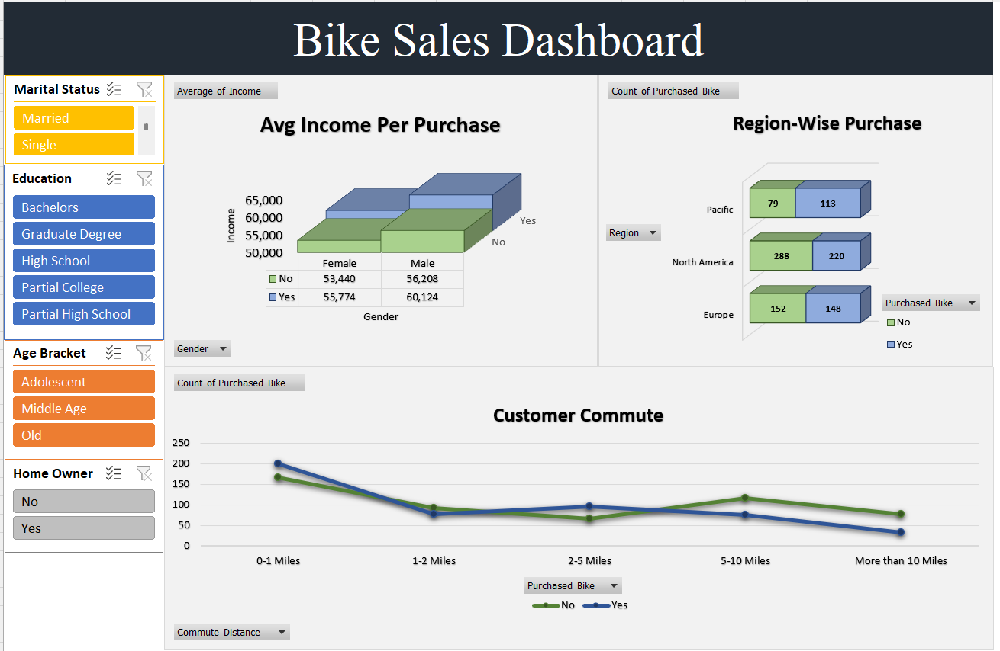

# Project 1: Bike Sales Dashboard

## Project Objective

The objective of this project is to analyze customer purchasing behavior and identify the key factors that influence bike purchases.

This dashboard helps understand how income, age, commute distance, gender, marital status, education, and region affect customer buying decisions.

## Dashboard Preview

## Tools Used

* Microsoft Excel
* Pivot Tables
* Pivot Charts
* Slicers
* Dashboard Design
* Data Cleaning
* Data Visualization
* Dashboard Reporting

## KPIs Analyzed

* Average Income per Purchase
* Customer Age Bracket Analysis
* Commute Distance Analysis
* Purchase Behavior by Gender
* Region-wise Purchase Trends
* Marital Status Analysis
* Education-wise Purchase Insights
* Occupation-based Purchase Analysis

## Key Insights

* Customers with higher average income showed a higher tendency to purchase bikes
* Middle-aged customers purchased bikes more frequently compared to other age groups
* Customers with shorter commute distances showed stronger purchase behavior
* Male customers showed slightly higher purchase rates in some regions
* Married customers showed strong buying patterns in specific customer segments
* Education and occupation also influenced bike purchase decisions significantly

## Business Recommendation

The company should focus marketing efforts on middle-aged customers with higher income, shorter commute distances, and strong purchasing behavior patterns to improve sales performance and customer targeting.

---

**Project by Lokesh Sharma**
