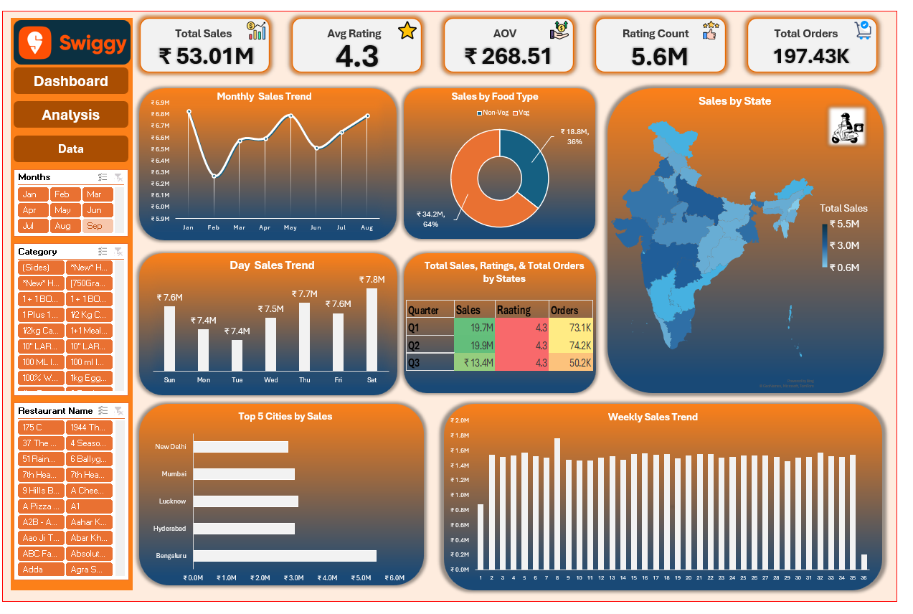

# Swiggy Sales & Revenue Analysis Dashboard

## Project Objective

The objective of this project was to analyze a large-scale dataset (approx. **197,000+ records**) from **Swiggy** to evaluate regional sales performance, consumer ordering patterns, and service quality benchmarks. 

By leveraging **Advanced Excel**, I transformed raw, unstructured data into a dynamic decision-support tool. This dashboard enables stakeholders to identify high-growth regions, optimize menu offerings based on food category demand (Veg vs. Non-Veg), and monitor customer satisfaction through rating trends.

---

## Dashboard Preview

---

## Tools & Technical Skills

- **Data Cleaning & ETL:** Manual data auditing, removing duplicates, handling null values, and standardizing text strings.
- **Feature Engineering:** Derived new attributes such as **Quarter**, **Week Number**, and **Day of the Week** from raw timestamps to enable time-series analysis.
- **Pivot Tables & Modeling:** Aggregated high-volume data to create multi-dimensional relationships.
- **Data Visualization:** Built dynamic **Pivot Charts**, **Slicers**, and **Timeline** filters for interactive reporting.
- **KPI Reporting:** Developed a centralized executive summary tracking core business metrics.

---

## KPIs Analyzed

- **Total Revenue (₹53.01M):** Aggregated sales across all regions and categories.
- **Average Order Value (AOV):** Calculated at **₹268.51**, serving as a baseline for revenue optimization.
- **Total Orders (197,430):** High-volume transaction tracking to measure platform scale.
- **Average Rating (4.34/5):** A critical metric for monitoring restaurant partner performance and customer satisfaction.
- **Ratings Count (5.5M+):** Quantitative assessment of customer engagement and feedback volume.
- **Monthly & Weekly Sales Trends:** Identification of seasonal demand and performance consistency.

---

## Key Insights

- **Market Dominance:** **Bengaluru** is the primary revenue driver, contributing **₹5.4M**, followed by Hyderabad and Lucknow, highlighting a strong South and North Indian market presence.
- **Consumer Preferences:** **Veg options** dominate the order volume, indicating a significant market segment that can be targeted for exclusive "Veg-only" loyalty programs.
- **Revenue Stability:** Monthly sales show high resilience, consistently hovering between **₹6.5M and ₹6.8M**, suggesting a stable and recurring customer base.
- **Operational Consistency:** Despite the high volume of orders, the **Average Rating of 4.34** remains stable, reflecting high service standards across the platform.
- **Weekly Volatility:** Identified specific peaks in **Weeks 8 and 12**, which likely correlate with promotional campaigns or festive demand, providing a blueprint for future marketing schedules.

---

## Business Recommendations

- **Expansion Strategy:** Implement aggressive marketing in high-potential cities like Mumbai and New Delhi to replicate the success seen in the Bengaluru market.
- **AOV Optimization:** Introduce "Bundle Deals" or "Smart Add-ons" to push the Average Order Value (AOV) from ₹268 toward the ₹300 mark.
- **Strategic Supply Management:** Given the preference for Veg food, Swiggy should onboard more premium Veg-only restaurant partners to increase the premium-tier order volume.
- **Data-Driven Promotions:** Align discount cycles with the identified "Low-Sales" weeks to smooth out the revenue curve across the month.

---

**Project by Lokesh Kr Sharma**
